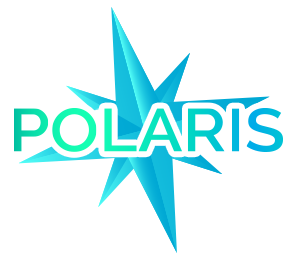

# polaris-core

[](https://www.npmjs.com/package/@enigmatis/polaris-core)
[](https://travis-ci.com/Enigmatis/polaris-core)

Polaris is a set of libraries that help you create the perfect graphql service, integrated with type orm and the hottest API standards.
polaris-core organizes all of the libraries for you, and let you create your graphql service as easily as it can be.

## Features

-   GraphQL service creation (integrated with apollo-server & express)
-   Auto soft deletion of entities
-   Fetching Deltas of entities (including irrelevant entities)
-   Support realities
-   Standard errors
-   Standard logs
-   Standard GraphQL scalars

### PolarisServer

This is the server that you will use in order to create your own standardized GraphQL server.\
`PolarisServer` uses `ApolloServer` and starts the server with `Express`.

### PolarisServerConfig

Through this interface you should set the following configurations which will be supplied to the `PolarisServer`:

-   **typeDefs** (_any_) - The GraphQL schema written in SDL (Schema Definition Language).
    This will be used in order to create your GraphQL API.
-   **resolvers** (_any_) - The GraphQL resolvers that will be tied to your GraphQL schema.
    This object contains functions and logic for the GraphQL engine to invoke when using fields from the schema.
-   **port** (_number_) - Specify a port the `PolarisServer` should start the server on.
-   **applicationProperties** (_ApplicationProperties - optional_) - Properties that describe your repository.
    If you don't provide those properties, the core will put 'v1' in the version.
-   **allowSubscription** (boolean - optional) - Responsible for creating a websocket endpoint for graphql subscriptions.
-   **customMiddlewares** (_any[] - optional_) - Custom middlewares that can be provided the `PolarisServer` with.
-   **customContext** (_(context: any, connection?: Connection) => any - optional_) - You can provide the `PolarisServer` your own custom context.
    If you do not set your custom context, the core will use a default context.
-   **loggerConfiguration** (_LoggerConfiguration - optional_) - This is an interface that defines the logger in the `PolarisServer`.
    If you do not provide this property, the core will use default values for the logger.
-   **middlewareConfiguration** (_MiddlewareConfiguration - optional_) - This is an interface that defines what core middlewares should be activated/disabled.
-   **connection** (_Connection - optional_) - This class represents your connection with the database. Used in the core middlewares.
-   **shouldAddWarningsToExtensions** (_boolean - optional_) - _Default: true._ Specifies whether to return the warnings in the response extensions or not. 

### MiddlewareConfiguration

As mentioned above, this interface defines what core middlewares should be activated/disabled.

-   **allowDataVersionAndIrrelevantEntitiesMiddleware** (_boolean_) - Determine if `DataVersionMiddleware` and `IrrelevantEntitiesMiddleware` should be applied to the request.
-   **allowSoftDeleteMiddleware** (_boolean_) - Determine if `SoftDeleteMiddleware` should be applied to the request.
-   **allowRealityMiddleware** (_boolean_) - Determine if `RealityMiddleware` should be applied to the request.

### Custom context

First we will define the new context type, pay attention that we just added a new field in the root of the context,
and a new header in the request headers object.

```typescript
import { PolarisGraphQLContext, PolarisRequestHeaders } from '@enigmatis/polaris-core';

interface CustomRequestHeaders extends PolarisRequestHeaders {
    customHeader?: string | string[];
}

export interface CustomContext extends PolarisGraphQLContext {
    customField: number;
    requestHeaders: CustomRequestHeaders;
}
```

Then we will pass the custom context like this:

```typescript
import { ExpressContext, PolarisServer } from '@enigmatis/polaris-core';

const typeDefs = `...`;
const resolvers = { ... };

const customContext = (context: ExpressContext): Partial<CustomContext> => {
    const { req } = context;

    return {
        customField: 1000,
        requestHeaders: {
            customHeader: req.headers['custom-header'],
        },
    };
};

const server = new PolarisServer({
    typeDefs,
    resolvers,
    port: 8082,
    customContext,
});
```

### Subscriptions

Add the Subscription object to your schema

```
export const typeDefs = `
    type Query {
        ...
    }

    type Mutation {
        ...
        updateBook(id: String!, newTitle: String!): [Book]!
        ...
    }

    type Subscription {
        bookUpdated: Book
    }

    type Book implements RepositoryEntity {
        ...
    }
`;

```

now let's implement the subscription resolver logic

```
import { PubSub } from '@enigmatis/polaris-core';

const pubsub = new PubSub();
const BOOK_UPDATED = 'BOOK_UPDATED';

export const resolvers = {
    Query: { ... },
    Mutation: { ... },
    Subscription: {
        bookUpdated: {
            subscribe: () => pubsub.asyncIterator([BOOK_UPDATED]),
        },
    },
};
```

and inside the updateBook resolver we will publish the book that got changed:

```
pubsub.publish(BOOK_UPDATED, { bookUpdated: myBook })
```

When you create the server you have to allow subscriptions, so the server could create the endpoint

```
const server = new PolarisServer({
    typeDefs,
    resolvers,
    port: 8080,
    allowSubscription: true,
});
```

Just pay attention that in case you are using custom context as well, the subscription context will be different,
you can handle it like so:

```
const customContext = (context: ExpressContext): Partial<CustomContext> => {
    const { req, connection } = context;
    const headers = req ? req.headers : connection?.context;

    return {
        customField: 1000,
        requestHeaders: {
            customHeader: headers['custom-header'],
        },
    };
};
```

### Warnings

In order to have the ability of warnings, which returned in the extensions of the response, you will need to supply them to
polaris. you can supply the warnings through the context. let's see an example:

```
allBooksWithWarnings: async (
    parent: any,
    args: any,
    context: PolarisGraphQLContext,
): Promise<Book[]> => {
    const connection = getPolarisConnectionManager().get();
    context.returnedExtensions.warnings = ['warning 1', 'warning 2'];
    return connection.getRepository(Book).find(context, { relations: ['author'] });
}
```

And let's see an example of response with the warnings:
```json{
    "data": {
        "allBooks": [
            {
                "id": "53afd7e5-bf59-4408-acbc-1c5ebb5ff146",
                "title": "Book1",
                "author": {
                    "firstName": "Author1",
                    "lastName": "First"
                }
            },
            {
                "id": "4fab24e4-f584-4077-bb93-09cdfc88b202",
                "title": "Book2",
                "author": {
                    "firstName": "Author2",
                    "lastName": "Two"
                }
            }
        ]
    },
    "extensions": {
        "globalDataVersion": 2,
        "warnings": [
            "warning 1",
            "warning 2"
        ]
    }
}
```

You can see inside the `extensions` that we have the warnings we defined earlier.

### Example

```typescript
import { ApplicationProperties, PolarisServer } from '@enigmatis/polaris-core';

const typeDefs = `
    type Query {
        allPersons: [Person]
    }

    type Person implements RepositoryEntity {
        id: String!
        deleted: Boolean!
        createdBy: String!
        creationTime: DateTime!
        lastUpdatedBy: String
        lastUpdateTime: DateTime
        realityId: Int!
        name: String
    }
`;
const resolvers = {
    Query: {
        allPersons: () => [
            { name: 'foo bar', realityId: 0, deleted: false, dataVersion: 2 },
            { name: 'superman', realityId: 0, deleted: true, dataVersion: 3 },
            { name: 'hello world', realityId: 1, deleted: true, dataVersion: 3 },
            { name: 'something', realityId: 1, deleted: false, dataVersion: 4 },
        ],
    },
};
const applicationProperties: ApplicationProperties = {
    id: 'p0laris-c0re',
    name: 'polaris-core',
    version: 'v1',
    environment: 'environment',
    component: 'component',
};
const server = new PolarisServer({
    typeDefs,
    resolvers,
    port: 4000,
    applicationProperties,
});
server.start();
```

For any additional help and requests, feel free to contact us :smile:
